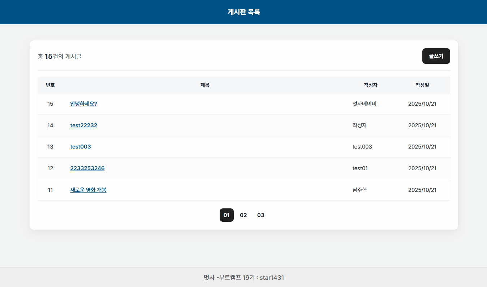
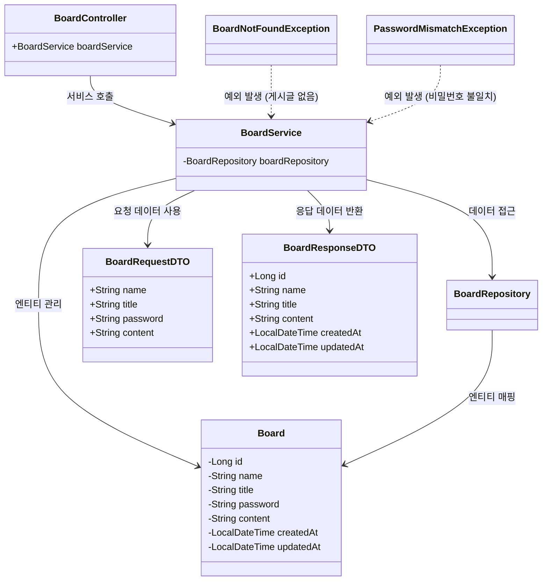
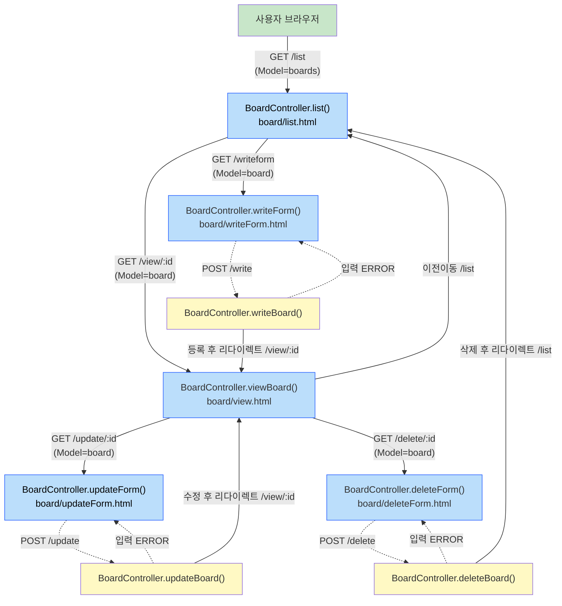

## Spring Boot MVC 게시판 crud 실습



## 1. 실습 개요

**목표**
- Spring Boot, Spring Data JDBC, Spring MVC 활용
- Spring Boot 프로젝트를 설정하고 필요한 의존성을 구성
- 데이터베이스 테이블을 설계하고 Spring Data JDBC로 연동
- MVC 패턴을 적용하여 계층별 책임을 분리
- 게시판의 CRUD 기능 구현

**개발 환경**
- IDE (IntelliJ)
- Java (JDK 21)
- Spring Boot (3.5.6)
- MySQL 8.0
- Docker

---

## 2. 요구사항 분석

### 2.1 기능 요구사항

1. **글 등록 화면** - 이름, 제목, 암호, 본문 입력 - 등록일, ID 자동 생성
2. **글 목록 화면** - 최신글 우선 표시 - ID, 제목, 이름, 등록일(YYYY/MM/DD) 표시
3. **글 상세 화면** - 암호는 숨김 처리 - 등록일 상세 표시 (YYYY/MM/DD HH:mm)
4. **글 수정 화면** - 이름, 제목, 본문 수정 가능, 암호 확인 필수, 수정일 자동 저장
5. **글 삭제 화면** - 암호 확인 필수
6. **입력 검증** - 필수 입력 항목 누락 시 오류 메시지 표시

---

## 3. DB 설계

### 3.1 테이블 설계

<details>
<summary><strong>DB & TABLE SQL문</strong></summary>

* 경로 : src/main/resources/query/db_mysql.sql

```sql
-- 데이터베이스 생성
CREATE DATABASE boarddb;
USE boarddb;

-- 기존 테이블 삭제 (필요 시)
DROP TABLE IF EXISTS board;

-- Board 테이블 생성
CREATE TABLE board (
       id BIGINT AUTO_INCREMENT PRIMARY KEY,
       name VARCHAR(100) NOT NULL,
       title VARCHAR(255) NOT NULL,
       password VARCHAR(255) NOT NULL,
       content TEXT NOT NULL,
       created_at DATETIME DEFAULT CURRENT_TIMESTAMP,
       updated_at DATETIME DEFAULT CURRENT_TIMESTAMP ON UPDATE CURRENT_TIMESTAMP
);

-- 인덱스 생성 (성능 최적화)
CREATE INDEX idx_board_created_at ON board(created_at DESC);


-- 샘플데이터
INSERT INTO board (name, title, password, content) VALUES
('김민수', '첫 번째 글입니다!', 'password123', '이것은 첫 번째 게시글의 내용입니다.'),
('이지은', '봄철 원예 팁', 'password123', '봄철 정원 가꾸기에 유용한 팁을 공유합니다.'),
('박영희', '올해의 여행지 추천 10곳', 'password123', '올해 방문하기 좋은 여행지 10곳을 소개합니다.'),
('최준호', 'SQL 이해하기', 'password123', 'SQL과 그 기능들에 대해 깊이 있게 알아봅시다.'),
('황소연', '최고의 코딩 습관', 'password123', '모든 개발자가 따라야 할 코딩 습관에 대해 알아봅시다.'),
('백은영', '사진 촬영 기초', 'password123', '초보자를 위한 사진 촬영 가이드입니다.'),
('윤서준', '기술의 미래', 'password123', '기술과 혁신의 미래에 대한 예측을 해봅니다.'),
('한지민', '예산 내에서 건강하게 먹기', 'password123', '예산을 깨지 않고 건강하게 먹는 방법을 공유합니다.'),
('정태웅', '초보자를 위한 운동 루틴', 'password123', '운동을 막 시작한 사람들을 위한 효과적인 운동 루틴을 소개합니다.'),
('김서영', '지역 뉴스 업데이트', 'password123', '최신 지역 뉴스를 업데이트합니다.'),
('남주혁', '새로운 영화 개봉', 'password123', '이번 주말 개봉하는 새로운 영화들을 확인해보세요.');


SELECT * FROM board;

-- db 계정 권한부여
GRANT ALL PRIVILEGES on boarddb.* to 'star1431'@'%';
FLUSH PRIVILEGES;

COMMIT;
```

</details>

#### 3.2 테이블 설명

| 필드명 | 타입 | null여부 | 기본값 | 설명 |
|--------|------|----------|-------|------|
| id     | BIGINT | NOT NULL | AUTO_INCREMENT | 게시글 고유 ID |
| name   | VARCHAR(100) | NOT NULL |  | 작성자 이름 |
| title  | VARCHAR(255) | NOT NULL |  | 게시글 제목 |
| password | VARCHAR(255) | NOT NULL |  | 게시글 비밀번호 |
| content | TEXT | NOT NULL |  | 게시글 내용 |
| created_at | DATETIME | NOT NULL | CURRENT_TIMESTAMP | 게시글 등록일 |
| updated_at | DATETIME | NOT NULL | CURRENT_TIMESTAMP ON UPDATE CURRENT_TIMESTAMP | 게시글 수정일 |

---

## 4. 클래스 설계

### 4.1 패키지 구조

```bash
src/main/java/com/simple/board
    ├── controller
    │   └── BoardController.java          # 게시판 컨트롤러
    │
    ├── service
    │   └── BoardService.java             # 게시판 서비스
    │
    ├── repository
    │   └── BoardRepository.java          # 게시판 리포지토리
    │
    ├── domain
    │   └── Board.java                    # 게시판 엔티티
    │
    ├── dto
    │   ├── BoardRequestDTO.java          # 게시판 요청 DTO
    │   └── BoardResponseDTO.java         # 게시판 응답 DTO
    │
    ├── exception
    │   ├── BoardNotFoundException.java    # 게시글 없음 예외
    │   └── PasswordMismatchException.java  # 비밀번호 불일치 예외
    │
    └── BoardApplication.java            # Spring Boot 메인 애플리케이션
```

### 4.2 클래스 다이어그램



---

## 5. URL 설계

### 5.1 URL 구조

```bash
url
 ├── /list               (GET)   - 글 목록 조회
 ├── /view?id={id}       (GET)   - 글 상세 화면
 ├── /writeform          (GET)   - 글 등록 form
 ├── /write              (POST)  - 글 등록 처리
 ├── /updateform?id={id} (GET)   - 글 수정 form
 ├── /update             (POST)  - 글 수정 처리
 ├── /deleteform?id={id} (GET)   - 글 삭제 form
 └── /delete             (POST)  - 글 삭제 처리
```

### 5.2 URL 흐름도



---

## 6. 클래스 구현

### 6.1 domain Package

#### Board 엔티티

* **어노테이션** : @Data, @Table("board"), @Id ...
* **필드** : id, name, title, password, content, createdAt, updatedAt
* **메서드** :
    * `isPasswordCorrect(...)` : 게시글 암호 확인
    * `update(...)` : 게시글 수정

<details>
<summary><strong>Board.java</strong></summary>

```java
package com.simple.board.domain;

import lombok.AllArgsConstructor;
import lombok.Data;
import lombok.Getter;
import lombok.NoArgsConstructor;
import lombok.Setter;
import lombok.ToString;
import org.springframework.data.annotation.Id;
import org.springframework.data.relational.core.mapping.Table;

import java.time.LocalDateTime;

/**
 * 게시글 엔티티 class
 * @author 정병천
 * @since 2025-10-21
 */
@Data // getter, setter, tostring, equals
@NoArgsConstructor
@AllArgsConstructor
@Table("board")
public class Board {
    @Id
    private Long id;            // pk
    private String name;        // 작성자
    private String title;       // 제목
    private String password;    // 게시글암호
    private String content;     // 글내용
    private LocalDateTime createdAt;    // 생성일
    private LocalDateTime updatedAt;    // 수정일

    /** 암호 확인 */
    public boolean isPasswordCorrect(String inputPassword) {
        if(this.password == null) return false;
        return this.password.equals(inputPassword);
    }
    
    /** 수정 - 수정일반영 */
    public void update(String name, String title, String content) {
        this.name = name;
        this.title = title;
        this.content = content;
        this.updatedAt = LocalDateTime.now();
    }
}

```

</details>

---


### 6.2 dto Package

#### BoardResponseDTO (응답)

* **어노테이션** : @Data, @Builder ...
* **필드** :  id, name, title, content, createdAt, updatedAt (String 타입)
* **메서드** :
    * `from(...)` : Board 엔티티를 resDTO로 변환 및 포맷팅

<details>
<summary><strong>BoardResponseDTO.java</strong></summary>

```java
package com.simple.board.dto;

import com.simple.board.domain.Board;
import jdk.jshell.Snippet;
import lombok.AllArgsConstructor;
import lombok.Builder;
import lombok.Data;
import lombok.Getter;
import lombok.NoArgsConstructor;
import lombok.Setter;

import javax.management.StringValueExp;
import java.time.LocalDateTime;
import java.time.format.DateTimeFormatter;

/**
 * 응답 DTO
 * @author 정병천
 * @since 2025-10-21
 */
@Data
@Builder
@NoArgsConstructor
@AllArgsConstructor
public class BoardResponseDTO {
    private String id;
    private String name;
    private String title;
    private String password;
    private String content;
    private String createdAt;
    private String updatedAt;
    
    /** 정보 빌드 */
    public static BoardResponseDTO from(Board board) {
        DateTimeFormatter formatterDate = DateTimeFormatter.ofPattern("yyyy/MM/dd");
        DateTimeFormatter formatterDateTime = DateTimeFormatter.ofPattern("yyyy/MM/dd HH:mm:ss");

        return BoardResponseDTO.builder()
                .id(String.valueOf(board.getId()))
                .name(board.getName())
                .title(board.getTitle())
                .password(board.getPassword())
                .content(board.getContent())
                .createdAt(board.getCreatedAt().format(formatterDate))
                .updatedAt(board.getUpdatedAt().format(formatterDateTime))
                .build();
    }
}
```
</details>


#### BoardRequestDTO (요청)

* **어노테이션** : @Data ...
* **필드** :  name, title, password, content
* **valid** : @NotBlank, @Size 등

<details>
<summary><strong>BoardRequestDTO.java</strong></summary>

```java
package com.simple.board.dto;

import jakarta.validation.constraints.NotBlank;
import jakarta.validation.constraints.Size;
import lombok.AllArgsConstructor;
import lombok.Data;
import lombok.Getter;
import lombok.NoArgsConstructor;
import lombok.Setter;

/**
 * 요청 DTO
 * @author 정병천
 * @since 2025-10-21
 */
@Data
@NoArgsConstructor
@AllArgsConstructor
public class BoardRequestDTO {

    @NotBlank(message = "입력 필수")
    @Size(max = 100, message = "100자 이하 입력해주세요.")
    private String name;

    @NotBlank(message = "입력 필수")
    @Size(max = 255, message = "255자 이하 입력해주세요.")
    private String title;

    @NotBlank(message = "입력 필수")
    @Size(max = 255, message = "255자 이하 입력해주세요.")
    private String password;

    @NotBlank(message = "입력 필수")
    private String content;
}

```
</details>

---

### 6.3 Repository Package

#### BoardRepository

* **어노테이션** : @Repository
* **상속** : CrudRepository, PagingAndSortingRepository

<details>
<summary><strong>BoardRepository.java</strong></summary>

```java
package com.simple.board.repository;

import com.simple.board.domain.Board;
import org.springframework.data.repository.CrudRepository;
import org.springframework.data.repository.PagingAndSortingRepository;
import org.springframework.stereotype.Repository;

/**
 * @author 정병천
 * @since 2025-10-21
 */
@Repository
public interface BoardRepository extends CrudRepository<Board, Long>, PagingAndSortingRepository<Board, Long> {

    // 기본 메소드 제공:
    // - save(), findById(), findAll(), deleteById(), count()
}
```

</details>

---

### 6.4 exception Package

#### BoardNotFoundException

* **게시글 없음 예외 처리 용도**
* **상속** : RuntimeException

<details>
<summary><strong>BoardNotFoundException.java</strong></summary>

```java
package com.simple.board.exception;

/**
 * 게시글 못찾음 exception
 * @autor 정병천
 * @since 2025-10-21
 */
public class BoardNotFoundException extends RuntimeException {
    public BoardNotFoundException(String message) {
        super(message);
    }
}
```

</details>

#### PasswordMismatchException

* **암호 불일치 처리 용도**
* **상속** : RuntimeException

<details>
<summary><strong>PasswordMismatchException.java</strong></summary>

```java
package com.simple.board.exception;

/**
 * 암호 불일치 exception
 * @autor 정병천
 * @since 2025-10-21
 */
public class PasswordMismatchException extends RuntimeException {
    public PasswordMismatchException(String message) {
        super(message);
    }
}

```

</details>


---

### 6.5 Service Package

#### BoardService

* **어노테이션** : @Service, @RequiredArgsConstructor, 그 외 선택
* **필드** : boardRepository
* **메서드** :
    * `getBoardList(...)` : 게시글 목록 조회 (페이징)
    * `getBoard(...)` : 게시글 상세 조회
    * `createBoard(...)` : 게시글 등록
    * `updateBoard(...)` : 게시글 수정
    * `deleteBoard(...)` : 게시글 삭제

<details>
<summary><strong>BoardService.java</strong></summary>

```java
package com.simple.board.service;

import com.simple.board.domain.Board;
import com.simple.board.dto.BoardRequestDTO;
import com.simple.board.dto.BoardResponseDTO;
import com.simple.board.exception.BoardNotFoundException;
import com.simple.board.exception.PasswordMismatchException;
import com.simple.board.repository.BoardRepository;
import lombok.RequiredArgsConstructor;
import org.springframework.data.domain.Page;
import org.springframework.data.domain.Pageable;
import org.springframework.stereotype.Service;
import org.springframework.transaction.annotation.Transactional;

import java.time.LocalDateTime;
import java.util.List;
import java.util.stream.StreamSupport;

/**
 * 게시판 서비스계층 class
 * @author 정병천
 * @since 2025-10-21
 */
@Service
@RequiredArgsConstructor
@Transactional (readOnly = true)
public class BoardService {
    private final BoardRepository boardRepository;

    /** 목록 조회 */
    public Page<BoardResponseDTO> getBoardList(Pageable pageable) {
        // Page 매핑 - PagingAndSortingRepository 종속됨
        Page<BoardResponseDTO> boardsDTO = boardRepository.findAll(pageable)
                .map(BoardResponseDTO::from);

        return boardsDTO;
    }

    /** 상세 조회 */
    public BoardResponseDTO getBoard(Long id) {
        // 엔티티 변환
        Board board = boardRepository.findById(id)
                .orElseThrow(() -> new BoardNotFoundException("board못찾음:: " + id));

        return BoardResponseDTO.from(board);
    }

    /** 게시글 등록 */
    @Transactional // readonly false로
    public Long createBoard(BoardRequestDTO reqDTO) {
        // 엔티티 생성
        Board board = new Board(
                null,
                reqDTO.getName(),
                reqDTO.getTitle(),
                reqDTO.getPassword(),
                reqDTO.getContent(),
                LocalDateTime.now(), // 생성일
                LocalDateTime.now() // 수정일
        );
        Board saved = boardRepository.save(board);

        return saved.getId();
    }

    /** 게시글 수정 */
    @Transactional // readonly false로
    public void updateBoard(Long id, BoardRequestDTO reqDTO) {
        // 대상 엔티티 get
        Board board = boardRepository.findById(id)
                .orElseThrow(() -> new BoardNotFoundException("board못찾음:: " + id));

        // 비번 검증
        if (!board.isPasswordCorrect(reqDTO.getPassword())) {
            throw new PasswordMismatchException("비밀번호 불일치");
        } else {
            board.update(
                reqDTO.getName(),
                reqDTO.getTitle(),
                reqDTO.getContent()
            );
            boardRepository.save(board);
        }

    }

    /** 게시글 삭제 */
    @Transactional // readonly false로
    public void deleteBoard(Long id, String password) {
        // 대상 엔티티 get
        Board board = boardRepository.findById(id)
                .orElseThrow(() -> new BoardNotFoundException("board못찾음:: " + id));

        // 비번 검증
        if (!board.isPasswordCorrect(password)) {
            throw new PasswordMismatchException("비밀번호 불일치");
        } else {
            boardRepository.deleteById(id);
        }
    }
}
```

</details>

---


### 6.6 Controller Package

#### BoardController

* **어노테이션** : @Controller, @RequiredArgsConstructor
* **필드** : boardService
* **메서드** :
    * `BoardList(...)` : (GET) 글 목록 화면
    * `viewBoard(...)` : (GET) 글 상세 화면
    * `writeForm(...)` : (GET) 글 등록 form
    * `writeBoard(...)` : (POST) 글 등록 처리
    * `updateForm(...)` : (GET) 글 수정 form
    * `updateBoard(...)` : (POST) 글 수정 처리
    * `deleteForm(...)` : (GET) 글 삭제 form
    * `deleteBoard(...)` : (POST) 글 삭제 처리

<details>
<summary><strong>BoardController.java</strong></summary>

```java
package com.simple.board.controller;

import com.simple.board.domain.Board;
import com.simple.board.dto.BoardRequestDTO;
import com.simple.board.dto.BoardResponseDTO;
import com.simple.board.exception.PasswordMismatchException;
import com.simple.board.service.BoardService;
import jakarta.validation.Valid;
import lombok.RequiredArgsConstructor;
import org.springframework.data.domain.Page;
import org.springframework.data.domain.Pageable;
import org.springframework.data.domain.Sort;
import org.springframework.data.web.PageableDefault;
import org.springframework.stereotype.Controller;
import org.springframework.ui.Model;
import org.springframework.validation.BindingResult;
import org.springframework.web.bind.annotation.GetMapping;
import org.springframework.web.bind.annotation.ModelAttribute;
import org.springframework.web.bind.annotation.PathVariable;
import org.springframework.web.bind.annotation.PostMapping;
import org.springframework.web.bind.annotation.RequestParam;

/**
 * 게시판 제어계층 class
 * @author 정병천
 * @since 2025-10-21
 */
@Controller
@RequiredArgsConstructor
// @RequestMapping("/board")
public class BoardController {
    private final BoardService boardService;

    /** 게시글 목록 */
    @GetMapping({"/", "/list"}) // localhost:8080/
    public String BoardList(
            Model model,
            // size: 리밋, sort : 기준점, drirection : 정렬타입
            @PageableDefault(size = 5, sort = "id", direction = Sort.Direction.DESC)
            Pageable pageable
    ) {
        Page<BoardResponseDTO> boards = boardService.getBoardList(pageable);
        model.addAttribute("boards", boards);
        model.addAttribute("dataTotal", boards.getTotalElements()); // getSize() ? 현재 페이징 내 갯수임.
        return "board/list";
    }

    /** 게시글 상세 */
    @GetMapping("/view/{id}") // localhost:8080/view/1
    public String viewBoard(Model model, @PathVariable("id") Long id) {
        BoardResponseDTO board = boardService.getBoard(id);
        model.addAttribute("board", board);
        return "board/view";
    }

    /** 게시글 등록 */
    @GetMapping("/writeform")
    public String writeForm(Model model) {
        // 요청 DTO 삽입
        model.addAttribute("board", new BoardRequestDTO());
        return "board/writeForm";
    }
    @PostMapping("/write")
    public String writeBoard(
            // 유효성 검증 - 어트리뷰트와 결과 객체
            @Valid @ModelAttribute("board") BoardRequestDTO reqDTO,
            BindingResult res
    ) {
        if(res.hasErrors()) return "board/writeForm"; // error 그대로
        Long id = boardService.createBoard(reqDTO);
        return "redirect:/view/" + id; // 상세글로 이동
    }

    /** 게시글 수정 */
    @GetMapping("/update/{id}")
    public String updateForm(Model model, @PathVariable("id") Long id) {
        BoardResponseDTO board = boardService.getBoard(id);
        board.setPassword(""); // resDTO의 pw값 날리고 진입
        model.addAttribute("board", board);
        model.addAttribute("id", id);
        return "board/updateForm";
    }
    @PostMapping("/update")
    public String updateBoard(
            // 유효성 검증 - 어트리뷰트와 결과 객체
            @Valid @ModelAttribute("board") BoardRequestDTO reqDTO,
            BindingResult res,
            @RequestParam("id") Long id,
            Model model
    ) {
        if(res.hasErrors()) {
            model.addAttribute("id", id);
            return "board/updateForm"; // error 그대로
        }
        try {
            boardService.updateBoard(id, reqDTO);
        } catch (PasswordMismatchException e) {
            // 비밀번호 불일치 시 다시 폼으로
            model.addAttribute("id", id);
            model.addAttribute("pwMismatch", "비밀번호가 일치하지 않습니다.");
            return "board/updateForm";
        }
        return "redirect:/view/" + id; // 상세글로 이동
    }

    /** 게시글 삭제 */
    @GetMapping("/delete/{id}")
    public String deleteForm(Model model, @PathVariable("id") Long id) {
        BoardResponseDTO board = boardService.getBoard(id);
        board.setPassword(""); // resDTO의 pw값 날리고 진입
        model.addAttribute("board", board);
        model.addAttribute("id", id);
        return "board/deleteForm";
    }
    @PostMapping("/delete")
    public String deleteBoard(
            // 유효성 검증 - 어트리뷰트와 결과 객체
            @Valid @ModelAttribute("board") BoardRequestDTO reqDTO,
            BindingResult res,
            @RequestParam("id") Long id,
            Model model
    ) {
        if(res.hasErrors()) {
            model.addAttribute("id", id);
            return "board/deleteForm"; // error 그대로
        }
        try {
            boardService.deleteBoard(id, reqDTO.getPassword());
        } catch (PasswordMismatchException e) {
            // 비밀번호 불일치 시 다시 폼으로
            model.addAttribute("id", id);
            model.addAttribute("pwMismatch", "비밀번호가 일치하지 않습니다.");
            return "board/deleteForm";
        }
        return "redirect:/list";
    }

}
```

</details>

---

## 7. view 화면 구현 (Thymeleaf)

### 7.1 html 파일

* 경로 : src/main/resources/templates/board/

<details>
<summary><strong>목록 : list.html</strong></summary>

```html
<!DOCTYPE html>
<html lang="en" xmlns:th="http://www.thymeleaf.org">
<head>
    <meta charset="UTF-8">
    <meta name="viewport" content="width=device-width, initial-scale=1.0">
    <title>게시판목록</title>
    <link rel="stylesheet" th:href="@{/css/app.css}">
</head>
<body>
    <header class="header">
        <h1>게시판 목록</h1>
    </header>
    <main class="main">
        <section class="section board">
            <article class="article normal">
                <div class="top_info_area">
                    <div class="side_left">
                        <span>총 <span>[[${dataTotal}]]</span>건의 게시글</span>
                    </div>
                    <div class="side_btn_group">
                        <a class="btn type_solid bg-1" title="글쓰기 화면으로 이동" th:href="@{/writeform}">글쓰기</a>
                    </div>
                </div>
                <div class="table_area">
                    <table>
                        <colgroup>
                            <col style="width: 64px">
                            <col style="width: auto">
                            <col style="width: 120px">
                            <col style="width: 140px">
                        </colgroup>
                        <thead>
                        <tr>
                            <th><span>번호</span></th>
                            <th><span>제목</span></th>
                            <th><span>작성자</span></th>
                            <th><span>작성일</span></th>
                        </tr>
                        </thead>
                        <tbody th:if="${!boards.empty}">
                            <tr th:each="board : ${boards}">
                                <td class="txt_center"><span>[[${board.id}]]</span></td>
                                <td>
                                    <a
                                        class="btn type_text underline"
                                        th:href="@{/view/{id}(id=${board.id})}"
                                        th:title="|${board.title} 게시글 보러가기|">
                                        [[${board.title}]]
                                    </a>
                                </td>
                                <td><span>[[${board.name}]]</span></td>
                                <td class="txt_center"><span>[[${board.createdAt}]]</span></td>
                            </tr>
                        </tbody>
                        <tbody th:if="${boards.empty}">
                            <tr class="nodata">
                                <td colspan="4" class="txt_center">
                                    <span>게시글 정보가 없습니다.</span>
                                </td>
                            </tr>
                        </tbody>
                    </table>
                    <div
                        class="paging_area"
                        th:if="${boards.totalPages > 0}">
                        <ul class="pagi_btn_lists">
                            <li th:each="i:${#numbers.sequence(1,boards.totalPages)}">
                                <!-- 루프 i == 페이징인덱스(1,2...) 이면 class append -->
                                <a
                                    class="btn type_text pagi"
                                    th:classappend="${i == (boards.number + 1)} ? ' active' : ''"
                                    th:href="@{/list(page=${i})}">
                                    [[${i < 10 ? '0' + i : i}]]
                                </a>
                            </li>
                        </ul>
                    </div>
                </div>
            </article>
        </section>
    </main>
    <footer class="footer">
        <p>멋사 -부트캠프 19기 : star1431</p>
    </footer>
</body>
<script type="text/javascript">
    document.addEventListener("DOMContentLoaded", () => {
        // console.log("되니?")
        const tableEl = document.querySelector('.table_area table');
        const trEls = tableEl.querySelectorAll('tbody tr');

        trEls.forEach(item => {
            const linkItem = item.querySelector('a');
            // console.log(linkItem)
            if(linkItem) {
                item.style.cssText = `cursor: pointer;`;
                item.setAttribute("tabindex", 0);
                item.addEventListener("keydown", (e) => {
                    if (e.key === 'Enter' || e.key === ' ') {
                        e.preventDefault();
                        link.click();
                    }
                });
                item.addEventListener("click", (e) => {
                    e.preventDefault();
                    window.location.href = linkItem.href;
                });
            }
        });
    });
</script>
</html>
```

</details>


<details>
<summary><strong>상세 : view.html</strong></summary>

```html
<!DOCTYPE html>
<html lang="en" xmlns:th="http://www.thymeleaf.org">
<head>
    <meta charset="UTF-8">
    <meta name="viewport" content="width=device-width, initial-scale=1.0">
    <title>게시글 상세</title>
    <link rel="stylesheet" th:href="@{/css/app.css}">
</head>
<body>
    <header class="header">
        <h1>게시글 상세</h1>
    </header>
    <main class="main">
        <section class="section view">
            <article class="article normal">
                <div class="view_area">
                    <div class="inner_head">
                        <div class="title_slot">
                            <span>[[${board.title}]]</span>
                        </div>
                        <div class="info_slot">
                            <div class="item">
                                <span>작성자 :</span><span>[[${board.name}]]</span>
                            </div>
                            <div class="item">
                                <span>작성일 :</span><span>[[${board.createdAt}]]</span>
                            </div>
                            <div class="item">
                                <span>수정일 :</span><span>[[${board.updatedAt}]]</span>
                            </div>
                        </div>
                    </div>
                    <div class="inner_body" th:text="${board.content}">
                    </div>
                    <div class="btn_area right">
                        <a class="btn type_solid bg-2" th:href="@{/list}">목록으로</a>
                        <a class="btn type_solid bg-3" th:href="@{/update/{id}(id=${board.id})}">수정하기</a>
                        <a class="btn type_solid bg-4" th:href="@{/delete/{id}(id=${board.id})}">삭제하기</a>
                    </div>
                </div>
            </article>
        </section>
    </main>
    <footer class="footer">
        <p>멋사 -부트캠프 19기 : star1431</p>
    </footer>
</body>
</html>
```

</details>


<details>
<summary><strong>등록 : writeForm.html</strong></summary>

```html
<!DOCTYPE html>
<html lang="en" xmlns:th="http://www.thymeleaf.org">
<head>
    <meta charset="UTF-8">
    <meta name="viewport" content="width=device-width, initial-scale=1.0">
    <title>게시글 등록</title>
    <link rel="stylesheet" th:href="@{/css/app.css}">
</head>
<body>
    <header class="header">
        <h1>게시글 등록</h1>
    </header>
    <main class="main">
        <section class="section form">
            <article class="article normal">
                <!-- action: 검증 메서드쪽 -->
                <form class="form" method="post" th:action="@{/write}" th:object="${board}">
                    <div class="form_item">
                        <div class="field">
                            <label for="title">제목</label>
                            <!-- th:field 없으면 유효성검증 후 value 날라감 -->
                            <input type="text" id="title" name="title" th:field="*{title}" placeholder="제목을 입력해주세요.">
                        </div>
                        <p class="err_msg" th:if="${#fields.hasErrors('title')}" th:errors="*{title}"></p>
                    </div>

                    <div class="form_item">
                        <div class="field">
                            <label for="name">작성자 </label>
                            <input type="text" id="name" name="name" th:field="*{name}" placeholder="이름을 입력해주세요.">
                        </div>
                        <p class="err_msg" th:if="${#fields.hasErrors('name')}" th:errors="*{name}"></p>
                    </div>

                    <div class="form_item">
                        <div class="field">
                            <label for="password">비밀번호</label>
                            <input type="text" id="password" name="password" th:field="*{password}" placeholder="설정할 비밀번호 입력해주세요.">
                        </div>
                        <p class="err_msg" th:if="${#fields.hasErrors('password')}" th:errors="*{password}"></p>
                    </div>

                    <div class="form_item">
                        <div class="field">
                            <label for="content">내용</label>
                            <textarea id="content" name="content" th:field="*{content}"  placeholder="내용 입력"></textarea>
                        </div>
                        <p class="err_msg" th:if="${#fields.hasErrors('content')}" th:errors="*{content}"></p>
                    </div>

                    <div class="btn_area center">
                        <button type="submit" class="btn type_line bg-1">등록하기</button>
                        <a class="btn type_line bg-4" th:href="@{/list}">이전</a>
                    </div>
                </form>
            </article>
        </section>
    </main>
    <footer class="footer">
        <p>멋사 -부트캠프 19기 : star1431</p>
    </footer>
</body>
</html>
```

</details>


<details>
<summary><strong>수정 : updateForm.html</strong></summary>

```html
<!DOCTYPE html>
<html lang="en" xmlns:th="http://www.thymeleaf.org">
<head>
    <meta charset="UTF-8">
    <meta name="viewport" content="width=device-width, initial-scale=1.0">
    <title>게시글 수정</title>
    <link rel="stylesheet" th:href="@{/css/app.css}">
</head>
<body>
    <header class="header">
        <h1>게시글 수정</h1>
    </header>
    <main class="main">
        <section class="section form">
            <article class="article normal">
                <!-- action: 검증 메서드쪽 -->
                <form class="form" method="post" th:action="@{/update}" th:object="${board}">
                    <input type="hidden" name="id" th:value="${id}"/>

                    <div class="form_item">
                        <div class="field">
                            <label for="title">제목</label>
                            <!-- th:field 없으면 유효성검증 후 value 날라감 -->
                            <input type="text" id="title" name="title" th:field="*{title}">
                        </div>
                        <p class="err_msg" th:if="${#fields.hasErrors('title')}" th:errors="*{title}"></p>
                    </div>

                    <div class="form_item">
                        <div class="field">
                            <label for="name">작성자 </label>
                            <input type="text" id="name" name="name" th:field="*{name}" readonly>
                        </div>
                    </div>

                    <div class="form_item">
                        <div class="field">
                            <label for="password">비밀번호 확인</label>
                            <input type="text" id="password" name="password" th:field="*{password}" th:value="${null}" placeholder="기존 비밀번호를 입력해주세요.">
                        </div>
                        <p class="err_msg" th:if="${#fields.hasErrors('password')}" th:errors="*{password}"></p>
                        <!-- 비밀번호 불일치 시 -->
                        <p class="err_msg" th:if="${pwMismatch}" th:text="${pwMismatch}"></p>
                    </div>

                    <div class="form_item">
                        <div class="field">
                            <label for="content">내용</label>
                            <textarea id="content" name="content" th:field="*{content}"></textarea>
                        </div>
                        <p class="err_msg" th:if="${#fields.hasErrors('content')}" th:errors="*{content}"></p>
                    </div>

                    <div class="btn_area center">
                        <button type="submit" class="btn type_line bg-1">수정하기</button>
                        <a class="btn type_line bg-4" th:href="@{/view/{id}(id=${id})}">이전</a>
                    </div>
                </form>
            </article>
        </section>
    </main>
    <footer class="footer">
        <p>멋사 -부트캠프 19기 : star1431</p>
    </footer>
</body>
</html>

```

</details>


<details>
<summary><strong>삭제 : updateForm.html</strong></summary>

```html
<!DOCTYPE html>
<html lang="en" xmlns:th="http://www.thymeleaf.org">
<head>
    <meta charset="UTF-8">
    <meta name="viewport" content="width=device-width, initial-scale=1.0">
    <title>게시글 삭제</title>
    <link rel="stylesheet" th:href="@{/css/app.css}">
</head>
<body>
    <header class="header">
        <h1>게시글 삭제</h1>
    </header>
    <main class="main">
        <section class="section form">
            <article class="article normal">
                <!-- action: 검증 메서드쪽 -->
                <form class="form" method="post" th:action="@{/delete}" th:object="${board}">
                    <input type="hidden" name="id" th:value="${id}"/>

                    <div class="form_item">
                        <div class="field">
                            <label for="title">제목</label>
                            <!-- th:field 없으면 유효성검증 후 value 날라감 -->
                            <input type="text" id="title" name="title" th:field="*{title}" readonly>
                        </div>
                    </div>

                    <div class="form_item">
                        <div class="field">
                            <label for="name">작성자 </label>
                            <input type="text" id="name" name="name" th:field="*{name}" readonly>
                        </div>
                    </div>

                    <div class="form_item">
                        <div class="field">
                            <label for="password">비밀번호 확인</label>
                            <input type="text" id="password" name="password" th:field="*{password}" th:value="${null}" placeholder="기존 비밀번호를 입력해주세요.">
                        </div>
                        <p class="err_msg" th:if="${#fields.hasErrors('password')}" th:errors="*{password}"></p>
                        <!-- 비밀번호 불일치 시 -->
                        <p class="err_msg" th:if="${pwMismatch}" th:text="${pwMismatch}"></p>
                    </div>

                    <div class="form_item">
                        <div class="field">
                            <label for="content">내용</label>
                            <textarea id="content" name="content" th:field="*{content}" readonly></textarea>
                        </div>
                    </div>

                    <div class="btn_area center">
                        <button type="submit" class="btn type_line bg-1">삭제하기</button>
                        <a class="btn type_line bg-4" th:href="@{/view/{id}(id=${id})}">이전</a>
                    </div>
                </form>
            </article>
        </section>
    </main>
    <footer class="footer">
        <p>멋사 -부트캠프 19기 : star1431</p>
    </footer>
</body>
</html>
```

</details>


### 7.2 CSS 파일

* 경로 : src/main/resources/static/css/

<details>
<summary><strong>app.css</strong></summary>

```css
* { margin: 0; padding: 0; box-sizing: border-box; }
ul li, ol li { list-style: none; } 
a { text-decoration: none; }
inupt, textarea {font-family: "Pretendard", "Noto Sans KR", sans-serif;}
html { font-size: 62.5%; width: 100%; min-height: 100%; }
body { display: flex; flex-direction: column; font-size: 1.4rem; font-family: "Pretendard", "Noto Sans KR", sans-serif; bg-height: 1.5; color: #333; min-height: 100dvh; background: #f4f4f4; }


/* header */
.header { position: sticky; top: 0; margin: 0; padding: 20px 0; width: 100%; background: #005386; color: #fff; text-align: center; box-shadow: 0 2px 8px rgba(0,0,0,0.05); }
.header h1 { font-size: 1.8rem; color: #fff; text-align: center; }

/* main */
.main { width: 100%; padding: 20px; flex: 1; }

/* section */
.section {
    width: 100%; margin: 20px auto; background-color: #fff; border: 1px solid #e5e7eb; border-radius: 12px; box-shadow: 0 8px 24px rgba(0,0,0,.06);
    &.board { max-width: 1080px; }
    &.view { max-width: 1080px; }
    &.form { max-width: 980px; }
}
.article {
    width: 100%; padding: 20px;
    &.normal { padding: 20px; }
    &.large { padding: 32px; }
}

/* footer */
.footer { margin-top: auto; margin: 32px 0 0 0; padding: 16px 0; width: 100%; background: #eee; color: #555; text-align: center; font-size: 1.6rem; border-top: 1px solid #ddd;}

/* class common */
.txt_center { text-align: center; }

/* btn common */
.btn_area {
    display: flex; gap: 8px;
    &.center { justify-content: center; }
    &.right { justify-content: right; }
    &.left { justify-content: left;}
}

.btn { display: inline-flex; align-items: center; justify-content: center; gap: 6px; border-radius: 8px; padding: 10px 16px; font-size: 1.4rem; font-weight: 600; bg-height: 1; text-decoration: none; cursor: pointer; border: 1px solid transparent; transition: all .18s ease; white-space: nowrap; color: #111; }
.btn.type_solid { background: #222; color: #fff; border-color: #222; border-width: 1px; box-shadow: 0 2px 6px rgba(0,0,0,.06); }
.btn.type_solid:hover { background: #333; border-color: #333; }

.btn.bg-1 { background: #222; border-color: #222; color: #fff; } /* 기본 블랙 */
.btn.bg-1:hover { background: #333; border-color: #333; }
.btn.bg-2 { background: #005386; border-color: #005386; color: #fff; } /* 네이비 블루 */
.btn.bg-2:hover { background: #003b5f; border-color: #003b5f; }
.btn.bg-3 { background: #16a34a; border-color: #16a34a; color: #fff; } /* 초록 */
.btn.bg-3:hover { background: #15803d; border-color: #15803d; }
.btn.bg-4 { background: #6b7280; border-color: #6b7280; color: #fff; } /* 그레이 */
.btn.bg-4:hover { background: #4b5563; border-color: #4b5563; }

.btn.type_text { background: transparent; border: none; color: #005386; padding: 6px 4px; }
.btn.type_text:hover { color: #003b5f; }
.btn.type_text.underline { text-decoration: underline; }
.btn.is-danger { background: #e11d48; border-color: #e11d48; color: #fff; }
.btn.is-danger:hover { background: #be123c; border-color: #be123c; }
.btn[disabled], .btn.is-disabled { opacity: .45; cursor: not-allowed; pointer-events: none; }

/* list.html */
.top_info_area { display: flex; align-items: center; justify-content: space-between; gap: 16px; padding-bottom: 16px; margin-bottom: 16px; border-bottom: 1px solid #e5e7eb; }
.side_left { font-size: 1.6rem; color: #54585e; }
.side_left span span { font-size: 1.8rem; color: #111827; font-weight: 700; }
.side_btn_group { display: flex; gap: 8px; }

.table_area { }
.table_area table { width: 100%; border-collapse: separate; border-top: 1px solid #e5e7eb; border-spacing: 0; overflow: hidden; box-shadow: 0 2px 6px rgba(0,0,0,.04); }
.table_area thead th { background: #f4f6f8; color: #111827; font-size: 1.3rem; font-weight: 700; text-align: center; padding: 12px 14px; border-bottom: 1px solid #e5e7eb; }
.table_area tbody td { font-size: 1.4rem; color: #333; padding: 12px 14px; border-bottom: 1px solid #eee; background: #fff; }
.table_area tbody tr { border-color: unset; }
.table_area tbody tr:nth-child(2n) td { background: #fcfcfd; }
.table_area tbody tr:hover td { background: #f8fbff; }
.table_area .nodata td { text-align: center; color: #999; padding: 36px 14px; }
.table_area a.btn.type_text.underline { font-size: 1.4rem; }

.paging_area { display: flex; align-items: center; justify-content: center; margin-top: 20px; }
.pagi_btn_lists { display: flex; gap: 6px; }
.pagi_btn_lists .btn.type_text.pagi { padding: 8px 10px; border-radius: 8px; color: #111; }
.pagi_btn_lists .btn.type_text.pagi:hover { background: #f4f6f8; }
.pagi_btn_lists .btn.type_text.pagi.active { background: #222; color: #fff; }
.pagi_btn_lists .btn.type_text.nav { font-weight: 700; }

/* view.html */
.view_area {  }
.inner_head { display: flex; flex-direction: column; gap: 12px; padding-bottom: 16px; border-bottom: 1px solid #e5e7eb; }
.title_slot { display: flex; flex-wrap: wrap; align-items: baseline; gap: 10px; }
.title_slot > span:first-child { font-size: 1.8rem; font-weight: 800; color: #111827; }
.info_slot { display: flex; align-items: center; gap: 16px; overflow: hidden;}
.info_slot .item { position: relative; display: flex; flex-wrap: wrap; gap: 4px; font-size: 1.3rem; color: #6b7280; }
.info_slot .item:after {content: ''; position: absolute; top: 50%; left: -7.5px; transform: translateY(-50%); width: 1px; height: 12px; background-color: #6b7280; }
.info_slot .item span:nth-child(2n) { color: #374151; font-weight: 600; }
.inner_body { padding: 20px 0; font-size: 1.5rem; bg-height: 1.75; color: #1f2937; white-space: pre-line; margin-bottom: 20px; border-bottom: 1px solid #e5e7eb; }


/* write & edit */
.form { display: flex; flex-direction: column; gap: 16px; }
.form_item:last-child { margin-bottom: 4px; }
.field { display: grid; grid-template-columns: 140px 1fr; align-items: center; gap: 12px; }
.field label { font-size: 1.4rem; font-weight: 700; color: #374151; }
.field input[type="text"], .field input[type="password"], .field textarea { width: 100%; padding: 12px 14px; border: 1px solid #d1d5db; border-radius: 8px; font-size: 1.4rem; color: #111; background: #fff; transition: border-color .15s ease, box-shadow .15s ease; }
.field input:read-only, .field textarea:read-only {cursor: default; background-color: #e5e5e5;}
.field textarea { min-height: 180px; resize: vertical; }
.field input:not(:read-only):hover, .field textarea:not(:read-only):hover { border-color: #b6bec8; }
.field input:focus, .field textarea:focus { outline: none; border-color: #005386; box-shadow: 0 0 0 3px rgba(0,83,134,.15); }

.err_msg { margin: 6px 0 0 152px; font-size: 1.3rem; color: #e11d48; }
.form_item:has(.err_msg:empty) .err_msg { display: none; }
.form_item:has(.err_msg:not(:empty)) .field input,
.form_item:has(.err_msg:not(:empty)) .field textarea { border-color: #e11d48; box-shadow: 0 0 0 3px rgba(225,29,72,.12); }


@media (max-width: 768px) {
    margin: 12px auto;
    .top_info_area { padding: 12px 14px; }
    .table_area { padding: 6px 8px 16px; }
    .table_area table {border: 0;}
    .table_area thead { display: none; }
    .table_area table, .table_area tbody, .table_area tr, .table_area td { display: block; width: 100%; }
    .table_area tbody tr { border: 1px solid #e5e7eb; border-radius: 10px; margin-bottom: 12px; overflow: hidden; }
    .table_area tbody td { border: none; border-bottom: 1px dashed #eee; }
    .table_area tbody td:last-child { border-bottom: none; }
}
```

</details>